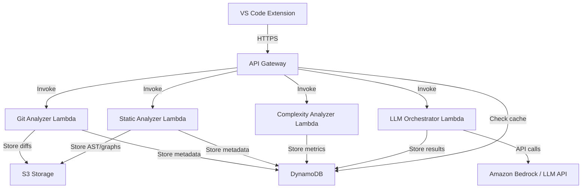
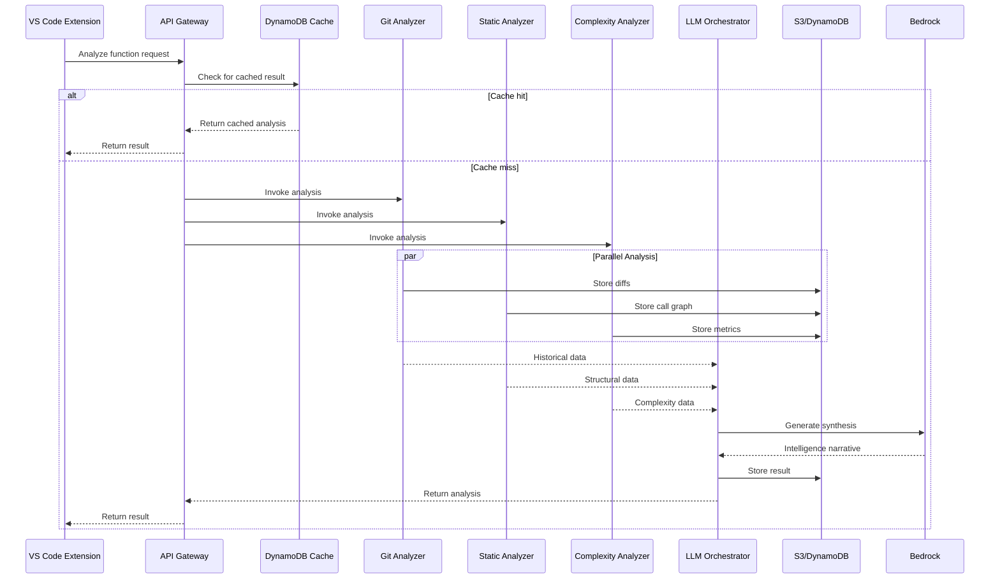

# Design Document: ChronoScope AI

## Overview

ChronoScope AI is a serverless, cloud-native Function Intelligence Platform built on AWS infrastructure. The system follows a microservices architecture where specialized Lambda functions handle distinct analysis tasks (Git history mining, static analysis, complexity computation, and LLM orchestration), coordinated through API Gateway and backed by DynamoDB and S3 storage.

The design emphasizes:
- **Modularity**: Each analysis component operates independently
- **Scalability**: Serverless architecture scales automatically with demand
- **Cost-efficiency**: Pay-per-use model with intelligent caching
- **Extensibility**: New analysis modules can be added without disrupting existing functionality

The VS Code extension serves as a thin client that delegates all heavy computation to the cloud backend, ensuring a responsive user experience regardless of codebase size.

## Architecture

### High-Level Architecture



### Component Interaction Flow



## Components and Interfaces

### 1. VS Code Extension

**Responsibilities:**
- Provide UI for function selection and analysis triggering
- Display analysis results in webview panel
- Manage API key configuration and secure storage
- Handle error states and loading indicators

**Key Interfaces:**
```typescript
interface AnalysisRequest {
  functionName: string;
  filePath: string;
  repositoryRoot: string;
  commitHash: string;
  language: string;
}

interface FunctionIntelligence {
  intentSummary: string;
  dependencyOverview: {
    upstreamCallers: string[];
    downstreamCallees: string[];
    impactRadius: number;
  };
  riskAssessment: {
    stabilityScore: number;
    riskLevel: 'Stable' | 'Moderate Risk' | 'High Risk';
    metrics: ComplexityMetrics;
  };
  refactoringRecommendations: string[];
  timestamp: string;
}

interface ComplexityMetrics {
  cyclomaticComplexity: number;
  linesOfCode: number;
  parameterCount: number;
  modificationFrequency: number;
  callSiteCount: number;
}
```

**Extension Activation:**
- Registers command: `chronoscope.analyzeFunction`
- Registers context menu item for function selection
- Loads API key from VS Code secret storage

### 2. API Gateway

**Responsibilities:**
- Route incoming requests to appropriate Lambda functions
- Validate API keys using AWS Secrets Manager
- Implement caching logic to reduce redundant computation
- Return appropriate HTTP status codes and error messages

**Endpoints:**
```
POST /analyze
  - Request body: AnalysisRequest
  - Response: FunctionIntelligence
  - Auth: API key in X-API-Key header

GET /history/{repository}/{function}
  - Response: Array<FunctionIntelligence>
  - Auth: API key in X-API-Key header
```

**Caching Strategy:**
- Cache key: `{repositoryRoot}:{filePath}:{functionName}:{commitHash}`
- Cache TTL: 24 hours
- Cache invalidation: Automatic on commit hash change

### 3. Git Analyzer Lambda

**Responsibilities:**
- Clone or access Git repository
- Extract commit history for target function
- Compute diffs showing function evolution
- Store diff snapshots in S3
- Pass historical data to LLM Orchestrator

**Implementation Approach:**
- Use `libgit2` or `GitPython` for Git operations
- Parse diffs to identify function-specific changes
- Extract commit metadata: message, author, timestamp, issue links
- Store diffs in S3 with key: `{repo}/diffs/{function}/{commitHash}.diff`

**Key Functions:**
```python
def analyze_git_history(repo_path: str, file_path: str, function_name: str) -> HistoricalData:
    """
    Analyzes Git history for a specific function.
    Returns commit metadata and diff summaries.
    """
    pass

def extract_function_commits(repo: Repository, file_path: str, function_name: str) -> List[Commit]:
    """
    Retrieves all commits that modified the target function.
    """
    pass

def compute_function_diff(commit: Commit, file_path: str, function_name: str) -> str:
    """
    Computes the diff for a specific function in a commit.
    """
    pass
```

### 4. Static Analyzer Lambda

**Responsibilities:**
- Parse source files into Abstract Syntax Trees
- Build call graphs representing function relationships
- Identify upstream callers and downstream callees
- Compute impact radius
- Store call graphs in S3

**Implementation Approach:**
- Use language-specific parsers:
  - Python: `ast` module
  - JavaScript/TypeScript: `@babel/parser` or `typescript` compiler API
  - Java: `JavaParser`
  - Go: `go/parser`
- Build bidirectional call graph using adjacency lists
- Perform graph traversal to compute impact radius

**Key Functions:**
```python
def parse_source_file(file_path: str, language: str) -> AST:
    """
    Parses source file into AST using language-specific parser.
    """
    pass

def build_call_graph(ast: AST, target_function: str) -> CallGraph:
    """
    Constructs call graph from AST.
    """
    pass

def compute_impact_radius(call_graph: CallGraph, target_function: str) -> Set[str]:
    """
    Computes transitive closure of all connected functions.
    """
    pass
```

**Call Graph Structure:**
```python
class CallGraph:
    nodes: Dict[str, FunctionNode]  # function_name -> node
    edges: Dict[str, List[str]]     # caller -> [callees]
    reverse_edges: Dict[str, List[str]]  # callee -> [callers]
```

### 5. Complexity Analyzer Lambda

**Responsibilities:**
- Compute cyclomatic complexity
- Count lines of code and parameters
- Query modification frequency from Git Analyzer
- Query call site count from Static Analyzer
- Compute stability score
- Classify risk level

**Implementation Approach:**
- Use AST to compute cyclomatic complexity (count decision points)
- Apply weighted formula for stability score:
  ```
  stability_score = (
    0.3 * normalized_complexity +
    0.3 * normalized_modification_frequency +
    0.2 * normalized_call_site_count +
    0.2 * normalized_loc
  )
  ```
- Risk classification:
  - Stable: score < 0.4
  - Moderate Risk: 0.4 ≤ score < 0.7
  - High Risk: score ≥ 0.7

**Key Functions:**
```python
def compute_cyclomatic_complexity(ast: AST, function_name: str) -> int:
    """
    Counts decision points (if, while, for, case, etc.).
    """
    pass

def compute_stability_score(metrics: ComplexityMetrics) -> float:
    """
    Computes weighted stability score from metrics.
    """
    pass

def classify_risk_level(stability_score: float) -> str:
    """
    Maps stability score to risk classification.
    """
    pass
```

### 6. LLM Orchestrator Lambda

**Responsibilities:**
- Aggregate data from all analysis components
- Construct structured prompts for LLM
- Call Amazon Bedrock or external LLM API
- Parse LLM responses into structured format
- Store Function Intelligence results in DynamoDB

**Implementation Approach:**
- Use prompt template with placeholders for analysis data
- Limit prompt size to 4000 tokens
- Implement retry logic with exponential backoff
- Parse LLM response using regex or structured output format

**Prompt Template:**
```
You are analyzing a function in a codebase. Based on the following data, provide:
1. Intent Summary: Why this function exists and how it evolved
2. Dependency Overview: Key upstream and downstream relationships
3. Risk Assessment: Stability analysis and concerns
4. Refactoring Recommendations: Actionable improvements

Historical Data:
{commit_history}

Structural Data:
- Upstream callers: {callers}
- Downstream callees: {callees}
- Impact radius: {impact_radius} functions

Complexity Metrics:
- Cyclomatic complexity: {complexity}
- Lines of code: {loc}
- Modification frequency: {mod_freq}
- Call site count: {call_sites}
- Stability score: {stability_score}
- Risk level: {risk_level}

Provide your analysis in the following JSON format:
{
  "intentSummary": "...",
  "dependencyOverview": "...",
  "riskAssessment": "...",
  "refactoringRecommendations": ["...", "..."]
}
```

**Key Functions:**
```python
def construct_prompt(historical_data: HistoricalData, 
                     structural_data: StructuralData,
                     complexity_data: ComplexityData) -> str:
    """
    Builds LLM prompt from analysis data.
    """
    pass

def call_llm_service(prompt: str) -> str:
    """
    Calls Amazon Bedrock or external LLM API with retry logic.
    """
    pass

def parse_llm_response(response: str) -> FunctionIntelligence:
    """
    Parses LLM response into structured format.
    """
    pass
```

## Data Models

### DynamoDB Schema

**Table: FunctionIntelligence**
```
Partition Key: repositoryId (String)
Sort Key: functionKey (String)  # format: {filePath}#{functionName}

Attributes:
- timestamp (Number) - Unix timestamp
- commitHash (String)
- intentSummary (String)
- upstreamCallers (List<String>)
- downstreamCallees (List<String>)
- impactRadius (Number)
- stabilityScore (Number)
- riskLevel (String)
- cyclomaticComplexity (Number)
- linesOfCode (Number)
- parameterCount (Number)
- modificationFrequency (Number)
- callSiteCount (Number)
- refactoringRecommendations (List<String>)
- analysisVersion (String)
- ttl (Number) - For automatic expiration

Indexes:
- GSI: functionKey-timestamp-index (for historical queries)
```

### S3 Object Structure

```
s3://chronoscope-artifacts/
  {repositoryId}/
    diffs/
      {functionKey}/
        {commitHash}.diff
    call-graphs/
      {commitHash}.json
    ast/
      {filePath}/{commitHash}.json
```

### In-Memory Data Structures

**HistoricalData:**
```python
@dataclass
class CommitInfo:
    hash: str
    message: str
    author: str
    timestamp: int
    issue_refs: List[str]
    diff_summary: str

@dataclass
class HistoricalData:
    commits: List[CommitInfo]
    first_introduced: CommitInfo
    total_modifications: int
```

**StructuralData:**
```python
@dataclass
class StructuralData:
    upstream_callers: List[str]
    downstream_callees: List[str]
    impact_radius: Set[str]
    call_graph_s3_key: str
```

**ComplexityData:**
```python
@dataclass
class ComplexityData:
    cyclomatic_complexity: int
    lines_of_code: int
    parameter_count: int
    modification_frequency: int
    call_site_count: int
    stability_score: float
    risk_level: str
```


## Correctness Properties

*A property is a characteristic or behavior that should hold true across all valid executions of a system—essentially, a formal statement about what the system should do. Properties serve as the bridge between human-readable specifications and machine-verifiable correctness guarantees.*

### Property 1: Function Metadata Extraction Completeness

*For any* valid function selection in the VS Code editor, extracting metadata should produce a complete AnalysisRequest containing function name, file path, repository root, commit hash, and language.

**Validates: Requirements 1.2**

### Property 2: Request Format Validity

*For any* extracted function metadata, the generated analysis request should conform to the AnalysisRequest interface schema and be accepted by the API Gateway.

**Validates: Requirements 1.3**

### Property 3: Invalid Function Rejection

*For any* code selection that is not a valid function definition, the VS Code extension should reject the selection and display an error message without sending a request.

**Validates: Requirements 1.5**

### Property 4: Complete Commit History Retrieval

*For any* function in a Git repository, the Git Analyzer should retrieve all commits that modified that function, with no commits missing from the history.

**Validates: Requirements 2.1**

### Property 5: Commit Metadata Completeness

*For any* retrieved commit, the extracted metadata should include commit message, author, timestamp, and issue references (if present).

**Validates: Requirements 2.2, 12.2**

### Property 6: Function Diff Computation

*For any* commit that modified a function, the Git Analyzer should successfully compute a diff showing the changes to that function.

**Validates: Requirements 2.3**

### Property 7: Storage Round-Trip Consistency

*For any* analysis artifact (diff snapshot, call graph, AST, Intent Narrative, Function Intelligence), storing it to S3 or DynamoDB and then retrieving it should produce an equivalent object.

**Validates: Requirements 2.4, 2.7, 3.6, 3.8, 4.8, 5.5**

### Property 8: Historical Data Propagation

*For any* collected historical data from the Git Analyzer, all commit messages and diff summaries should be passed to the LLM Orchestrator without data loss.

**Validates: Requirements 2.5**

### Property 9: Intent Narrative Generation

*For any* non-empty historical data, the LLM Orchestrator should generate an Intent Narrative that is non-empty and contains references to the function's purpose.

**Validates: Requirements 2.6**

### Property 10: AST Parsing Success

*For any* valid source file in a supported language, the Static Analyzer should successfully parse it into an Abstract Syntax Tree without errors.

**Validates: Requirements 3.1**

### Property 11: Complete Function and Call Identification

*For any* generated AST, the Static Analyzer should identify all function definitions and call expressions present in the syntax tree.

**Validates: Requirements 3.2**

### Property 12: Call Graph Structural Validity

*For any* set of identified functions and calls, the constructed Call Graph should be a valid directed graph where every edge represents an actual caller-callee relationship.

**Validates: Requirements 3.3**

### Property 13: Upstream Caller Identification

*For any* function in a call graph, the identified upstream callers should be exactly the set of functions that directly call the target function.

**Validates: Requirements 3.4**

### Property 14: Downstream Callee Identification

*For any* function in a call graph, the identified downstream callees should be exactly the set of functions that the target function directly calls.

**Validates: Requirements 3.5**

### Property 15: Impact Radius Transitivity

*For any* function in a call graph, the computed impact radius should include all functions reachable through transitive caller or callee relationships.

**Validates: Requirements 3.7**

### Property 16: Cyclomatic Complexity Validity

*For any* function AST, the computed cyclomatic complexity should be a positive integer equal to the number of decision points plus one.

**Validates: Requirements 4.1**

### Property 17: Lines of Code Accuracy

*For any* function, the counted lines of code should match the actual number of non-empty, non-comment lines in the function body.

**Validates: Requirements 4.2**

### Property 18: Parameter Count Accuracy

*For any* function, the counted parameter count should match the actual number of parameters in the function signature.

**Validates: Requirements 4.3**

### Property 19: Cross-Component Data Retrieval

*For any* function analysis, the Complexity Analyzer should successfully retrieve modification frequency from the Git Analyzer and call site count from the Static Analyzer.

**Validates: Requirements 4.4, 4.5**

### Property 20: Stability Score Computation

*For any* set of complexity metrics, the computed stability score should be a value between 0 and 1 calculated using the weighted formula: 0.3 × normalized_complexity + 0.3 × normalized_modification_frequency + 0.2 × normalized_call_site_count + 0.2 × normalized_loc.

**Validates: Requirements 4.6**

### Property 21: Risk Classification Mapping

*For any* stability score, the risk classification should be "Stable" if score < 0.4, "Moderate Risk" if 0.4 ≤ score < 0.7, and "High Risk" if score ≥ 0.7.

**Validates: Requirements 4.7**

### Property 22: Analysis Data Aggregation

*For any* completed analysis, the LLM Orchestrator should successfully retrieve Intent Narrative, Call Graph, Impact Radius, and Stability Score from storage.

**Validates: Requirements 5.1**

### Property 23: Prompt Structure Completeness

*For any* set of analysis data, the constructed LLM prompt should contain all required sections: historical data, structural data, and complexity metrics.

**Validates: Requirements 5.2**

### Property 24: LLM Service Communication

*For any* constructed prompt, the LLM Orchestrator should successfully send it to the LLM Service and receive a response.

**Validates: Requirements 5.3**

### Property 25: Response Parsing Completeness

*For any* LLM response, the parsed Function Intelligence should contain all four required sections: Intent Summary, Dependency Overview, Risk Assessment, and Refactoring Recommendations.

**Validates: Requirements 5.4**

### Property 26: Analysis Result Propagation

*For any* stored Function Intelligence result, it should be successfully returned to the API Gateway without data loss.

**Validates: Requirements 5.6**

### Property 27: Webview Content Completeness

*For any* Function Intelligence response, the displayed webview should contain all four sections: Intent Summary, Dependency Overview, Risk Assessment, and Refactoring Recommendations.

**Validates: Requirements 6.2, 6.3, 6.4, 6.5**

### Property 28: Error Message Display

*For any* error response from the API, the VS Code extension should display an error message containing the failure details.

**Validates: Requirements 6.7, 8.7**

### Property 29: Cache Lookup Priority

*For any* analysis request, the API Gateway should check the cache before invoking Lambda functions.

**Validates: Requirements 7.1**

### Property 30: Cache Validity Verification

*For any* cached entry, it should be considered valid only if it is less than 24 hours old AND the commit hash matches the current function state.

**Validates: Requirements 7.2, 7.3**

### Property 31: Cache Hit Optimization

*For any* valid cached entry, the API Gateway should return it directly without invoking any Lambda functions.

**Validates: Requirements 7.4**

### Property 32: Cache Miss Computation

*For any* invalid or missing cache entry, the API Gateway should invoke all required Lambda functions to perform fresh analysis.

**Validates: Requirements 7.5**

### Property 33: Cache Population

*For any* fresh analysis result, it should be stored in DynamoDB with a timestamp for future cache lookups.

**Validates: Requirements 7.6**

### Property 34: Repository Access Error Handling

*For any* Git repository that cannot be accessed, the Git Analyzer should return an error response indicating repository access failure.

**Validates: Requirements 8.1**

### Property 35: Parse Error Handling

*For any* source file that cannot be parsed, the Static Analyzer should return an error response indicating parsing failure with the file location.

**Validates: Requirements 8.2**

### Property 36: LLM Retry Logic

*For any* LLM service failure, the LLM Orchestrator should retry the request up to 3 times with exponential backoff before giving up.

**Validates: Requirements 8.3**

### Property 37: Graceful Degradation

*For any* LLM service failure after all retries, the LLM Orchestrator should return a partial analysis containing available data and an error message.

**Validates: Requirements 8.4**

### Property 38: Error Logging

*For any* error encountered in a Lambda function, the error details should be logged to CloudWatch Logs.

**Validates: Requirements 8.5**

### Property 39: HTTP Error Response Format

*For any* error condition, the API Gateway should return an appropriate HTTP status code (4xx or 5xx) and a JSON error message.

**Validates: Requirements 8.6**

### Property 40: API Key Validation

*For any* request to the API Gateway, the presence of an API key in the X-API-Key header should be validated.

**Validates: Requirements 9.1**

### Property 41: API Key Authorization

*For any* present API key, it should be verified against the authorized keys stored in AWS Secrets Manager.

**Validates: Requirements 9.2**

### Property 42: Authorized Request Forwarding

*For any* valid API key, the request should be forwarded to the appropriate Lambda functions.

**Validates: Requirements 9.3**

### Property 43: Unauthorized Request Rejection

*For any* invalid or missing API key, the API Gateway should return a 401 Unauthorized response.

**Validates: Requirements 9.4**

### Property 44: API Key Secure Storage

*For any* API key provided by the user, it should be stored in VS Code's secret storage and be retrievable for subsequent requests.

**Validates: Requirements 9.6**

### Property 45: Language Detection

*For any* source file with a recognized extension (.py, .js, .ts, .java, .go), the Static Analyzer should correctly detect the programming language.

**Validates: Requirements 10.1**

### Property 46: Language-Specific Parser Selection

*For any* detected language, the Static Analyzer should use the appropriate language-specific parser (Python parser for .py, JS/TS parser for .js/.ts, Java parser for .java, Go parser for .go).

**Validates: Requirements 10.2, 10.3, 10.4, 10.5**

### Property 47: Unsupported Language Error

*For any* source file with an unsupported extension, the Static Analyzer should return an error indicating unsupported language.

**Validates: Requirements 10.6**

### Property 48: Function Extraction Completeness

*For any* successfully parsed file, the Static Analyzer should extract all function definitions present in the file using language-specific syntax rules.

**Validates: Requirements 10.7**

### Property 49: Lambda Execution Time Limit

*For any* Lambda function invocation, execution should complete within 30 seconds.

**Validates: Requirements 11.1**

### Property 50: S3 Storage Class Configuration

*For any* artifact stored in S3, it should be created with S3 Intelligent-Tiering storage class.

**Validates: Requirements 11.2**

### Property 51: Prompt Token Limit

*For any* constructed LLM prompt, the token count should not exceed 4000 tokens.

**Validates: Requirements 11.4**

### Property 52: Concurrent Request Handling

*For any* set of up to 100 concurrent analysis requests, the API Gateway should handle them all without throttling.

**Validates: Requirements 11.5**

### Property 53: Unique Storage Identifier

*For any* Function Intelligence result, it should be stored in DynamoDB with a unique composite key consisting of repository path and function name.

**Validates: Requirements 12.1**

### Property 54: S3 Hierarchical Key Structure

*For any* artifact stored in S3, the object key should follow the hierarchical structure: {repositoryId}/{artifactType}/{functionKey}/{identifier}.

**Validates: Requirements 12.3**

### Property 55: Historical Analysis Retrieval

*For any* function, querying DynamoDB should return all historical analyses for that function.

**Validates: Requirements 12.4**

### Property 56: Chronological Ordering

*For any* set of historical analyses, they should be displayed in chronological order sorted by timestamp.

**Validates: Requirements 12.5**

## Error Handling

### Error Categories

1. **Client Errors (4xx)**
   - 400 Bad Request: Invalid function identifier or malformed request
   - 401 Unauthorized: Missing or invalid API key
   - 404 Not Found: Function or repository not found
   - 429 Too Many Requests: Rate limit exceeded

2. **Server Errors (5xx)**
   - 500 Internal Server Error: Unexpected Lambda function failure
   - 502 Bad Gateway: LLM service unavailable
   - 503 Service Unavailable: DynamoDB or S3 temporarily unavailable
   - 504 Gateway Timeout: Lambda execution exceeded time limit

### Error Response Format

All error responses follow this JSON structure:
```json
{
  "error": {
    "code": "ERROR_CODE",
    "message": "Human-readable error message",
    "details": {
      "component": "Git_Analyzer | Static_Analyzer | Complexity_Analyzer | LLM_Orchestrator",
      "timestamp": "ISO 8601 timestamp",
      "requestId": "Unique request identifier"
    }
  }
}
```

### Retry Strategy

**LLM Service Retries:**
- Initial delay: 1 second
- Maximum retries: 3
- Backoff multiplier: 2 (exponential backoff)
- Maximum delay: 8 seconds

**AWS Service Retries:**
- DynamoDB and S3 operations use AWS SDK default retry logic
- Maximum retries: 3 with exponential backoff

### Graceful Degradation

When the LLM service is unavailable after all retries:
1. Return partial analysis with available data
2. Include error message explaining LLM unavailability
3. Provide raw metrics and data for manual interpretation
4. Suggest retrying the analysis later

### Logging Strategy

**CloudWatch Logs Structure:**
- Log group per Lambda function: `/aws/lambda/{function-name}`
- Log level: INFO for normal operations, ERROR for failures
- Structured JSON logging for easy querying

**Logged Information:**
- Request ID for tracing
- Function name and file path
- Execution duration
- Error stack traces
- Key metrics (complexity, LOC, etc.)

## Testing Strategy

ChronoScope AI employs a dual testing approach combining unit tests for specific scenarios and property-based tests for comprehensive validation across diverse inputs.

### Unit Testing

Unit tests focus on:
- **Specific examples**: Testing known functions with expected outputs
- **Edge cases**: Empty repositories, single-function files, deeply nested calls
- **Error conditions**: Invalid API keys, malformed requests, network failures
- **Integration points**: Component communication, data serialization

**Example Unit Tests:**
- Test Git Analyzer with a repository containing exactly one commit
- Test Static Analyzer with a file containing no function calls
- Test Complexity Analyzer with a function having zero cyclomatic complexity
- Test cache hit when commit hash matches
- Test 401 response when API key is missing

### Property-Based Testing

Property tests validate universal correctness properties across randomly generated inputs. Each property test runs a minimum of 100 iterations to ensure comprehensive coverage.

**Property Test Configuration:**
- Testing framework: Hypothesis (Python), fast-check (TypeScript/JavaScript)
- Minimum iterations: 100 per property
- Each test tagged with: **Feature: chronoscope-ai, Property {number}: {property_text}**

**Example Property Tests:**

**Property 7: Storage Round-Trip Consistency**
```python
@given(function_intelligence=function_intelligence_strategy())
def test_storage_round_trip(function_intelligence):
    """
    Feature: chronoscope-ai, Property 7: Storage Round-Trip Consistency
    For any analysis artifact, storing and retrieving should produce equivalent object.
    """
    # Store to DynamoDB
    store_function_intelligence(function_intelligence)
    
    # Retrieve from DynamoDB
    retrieved = get_function_intelligence(
        function_intelligence.repository_id,
        function_intelligence.function_key
    )
    
    # Assert equivalence
    assert retrieved == function_intelligence
```

**Property 20: Stability Score Computation**
```python
@given(
    complexity=st.integers(min_value=1, max_value=50),
    mod_freq=st.integers(min_value=0, max_value=100),
    call_sites=st.integers(min_value=0, max_value=500),
    loc=st.integers(min_value=1, max_value=1000)
)
def test_stability_score_formula(complexity, mod_freq, call_sites, loc):
    """
    Feature: chronoscope-ai, Property 20: Stability Score Computation
    For any set of metrics, stability score should follow weighted formula.
    """
    metrics = ComplexityMetrics(
        cyclomatic_complexity=complexity,
        modification_frequency=mod_freq,
        call_site_count=call_sites,
        lines_of_code=loc
    )
    
    score = compute_stability_score(metrics)
    
    # Verify score is in valid range
    assert 0 <= score <= 1
    
    # Verify formula application
    expected = (
        0.3 * normalize(complexity, 1, 50) +
        0.3 * normalize(mod_freq, 0, 100) +
        0.2 * normalize(call_sites, 0, 500) +
        0.2 * normalize(loc, 1, 1000)
    )
    assert abs(score - expected) < 0.001
```

**Property 15: Impact Radius Transitivity**
```python
@given(call_graph=call_graph_strategy())
def test_impact_radius_transitivity(call_graph):
    """
    Feature: chronoscope-ai, Property 15: Impact Radius Transitivity
    For any function, impact radius should include all transitively connected functions.
    """
    target_function = random.choice(list(call_graph.nodes.keys()))
    impact_radius = compute_impact_radius(call_graph, target_function)
    
    # Verify all direct callers are included
    for caller in call_graph.reverse_edges.get(target_function, []):
        assert caller in impact_radius
    
    # Verify all direct callees are included
    for callee in call_graph.edges.get(target_function, []):
        assert callee in impact_radius
    
    # Verify transitivity: if A is in radius and A calls B, then B is in radius
    for func in list(impact_radius):
        for callee in call_graph.edges.get(func, []):
            assert callee in impact_radius
```

### Integration Testing

Integration tests verify end-to-end workflows:
- VS Code extension → API Gateway → Lambda functions → Storage → Response
- Cache hit and cache miss scenarios
- Multi-language analysis workflows
- Error propagation through the system

### Load Testing

Performance validation:
- 100 concurrent requests to verify API Gateway scaling
- Lambda cold start and warm execution timing
- DynamoDB read/write throughput under load
- S3 upload/download performance with large artifacts

### Security Testing

Security validation:
- API key validation and rejection of invalid keys
- SQL injection attempts in function names (should be sanitized)
- Path traversal attempts in file paths (should be blocked)
- Rate limiting enforcement

### Cost Monitoring

Track costs during testing:
- Lambda execution duration and memory usage
- DynamoDB read/write capacity units
- S3 storage and data transfer
- LLM API token consumption

Target: Maintain prototype costs under $170/month during testing phase.

